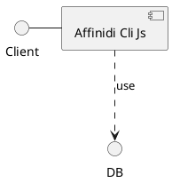

# Affinidi Cli Js

Here is technical documentation of the `Affinidi Cli Js` service.

## Architecture Diagram

Find below architecture diagram:

You can also use diagram from the link:

[Architecture Diagram](architecture.puml.md)
